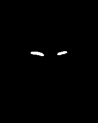
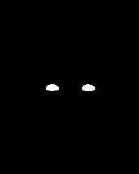
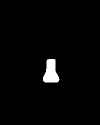
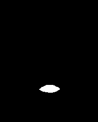
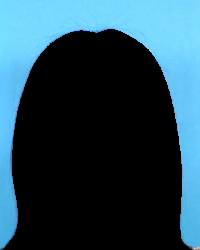
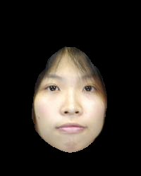
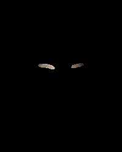
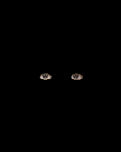
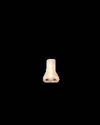
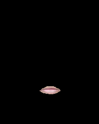

<!--
 * @Description: 
 * @Author: shaonianruntu
 * @Github: https://github.com/shaonianruntu
 * @Date: 2020-11-07 11:31:57
 * @LastEditTime: 2020-11-07 20:17:33
-->
# Face component segmentation based on Bisnet v2

## Code Description

This code is based on [face-parsing.PyTorch](https://github.com/zllrunning/face-parsing.PyTorch) project.

### `bisnetv2.py`

This is the Bisenet network used for face parsing aextraction, you shouldn't change anything of it. 
It is provided by [face-parsing.PyTorch](https://github.com/zllrunning/face-parsing.PyTorch) project.

### `test.py`

This is the main test execution code. You need to execute this code to get the parsing structure acquisition and joint output of face by calling `bisnetv2.py`.

Results are:
|  |                                         background                                         |                                      skin                                      |                                      brow                                      |                                     eye                                      |                                      nose                                      |                                      mouth                                       |
| :-----------------------------------------------------: | :----------------------------------------------------------------------------------------: | :----------------------------------------------------------------------------: | :----------------------------------------------------------------------------: | :--------------------------------------------------------------------------: | :----------------------------------------------------------------------------: | :------------------------------------------------------------------------------: |
|                      Paring Output                      |  |  |  |  |  |  |
|                      Joint Output                       |      |      |      |      |      |      |

## Support package required
- python3
- numpy
- matplotlib
- scipy
- seaborn
- PIL
- python-opencv
- pytorch

### Installation method

> These packages may not be included in Anaconda and require additional installation

#### `python-opencv`
```
sudo apt-get install python-opencv
```
